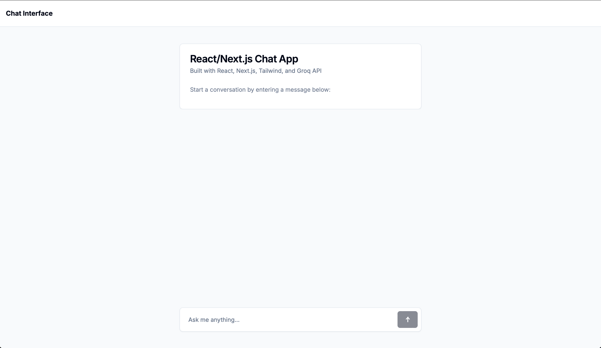
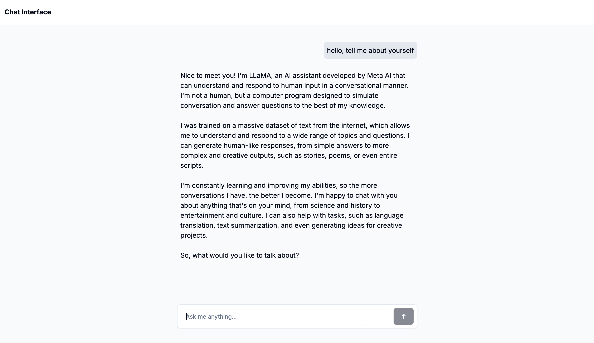
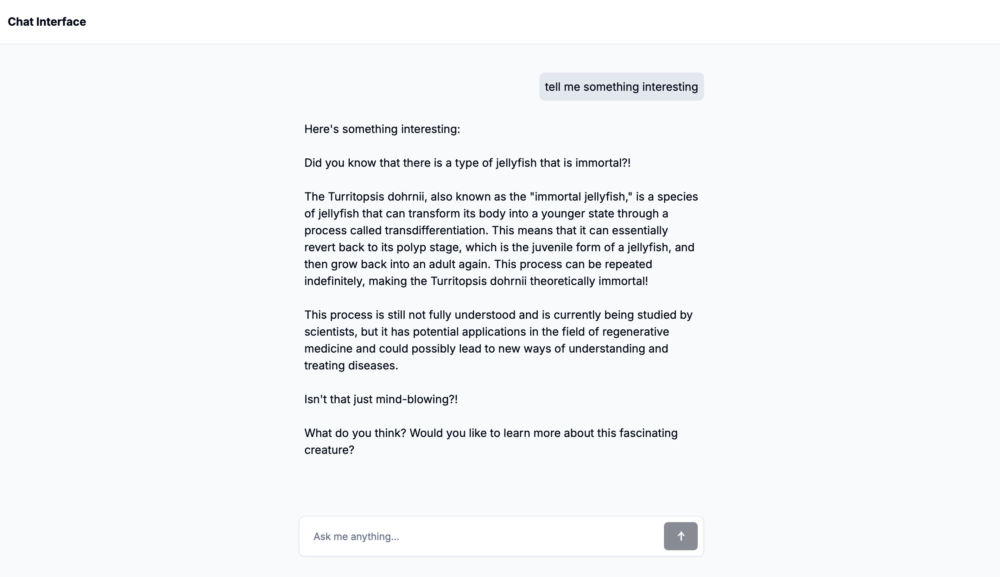

# React/Next.js AI Chat Interface
 
## Features

- React/Next.js-based chat interface
- Integration with Groq API for LLM model interaction
- Responsive design using Tailwind CSS

## Getting Started

1. Clone the repository
2. Install dependencies:
   ```bash
   npm install
   ```
3. Set up your environment variables:
   - Add your `GROQ_API_KEY` to the `.env` file

4. Run the development server:
   ```bash
   npm run dev
   ```

5. Open [http://localhost:3000](http://localhost:3000) in your browser to see the result.


## Project Screenshots









