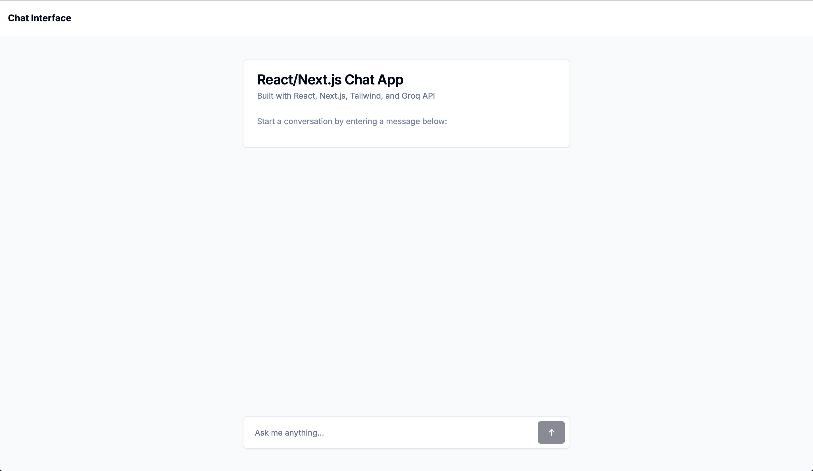
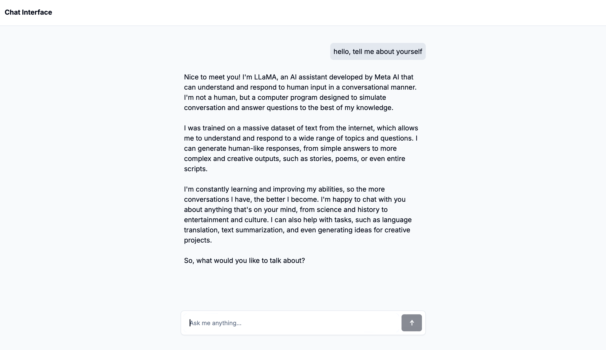
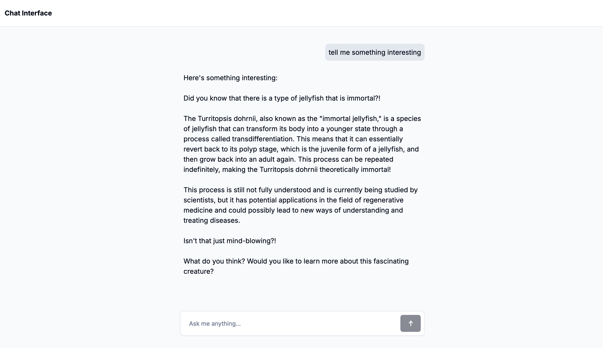

# React/Next.js AI Chat Interface
 
## Features

- React/Next.js-based chat interface
- Integration with Groq API for LLM model interaction
- Responsive design using Tailwind CSS

## Getting Started

1. Clone the repository
2. Install dependencies:
   ```bash
   npm install
   ```
3. Set up your environment variables:
   - Add your `GROQ_API_KEY` to the `.env` file

4. Run the development server:
   ```bash
   npm run dev
   ```

5. Open [http://localhost:3000](http://localhost:3000) in your browser to see the result.

## Selecting AI Model Provider and Model

To select an AI model provider and model, follow these steps:

1. In the chat interface, you will see two dropdown menus.
2. The first dropdown menu allows you to select the AI model provider. The available options are:
   - Groq
   - OpenAI
   - Google Cloud AI
   - Azure AI
3. The second dropdown menu allows you to select the AI model. The available options are:
   - Llama 3 8B 8192
   - GPT-3.5 Turbo
   - PaLM 2
   - Davinci
4. Select the desired provider and model from the dropdown menus before starting the conversation.

## Project Screenshots






